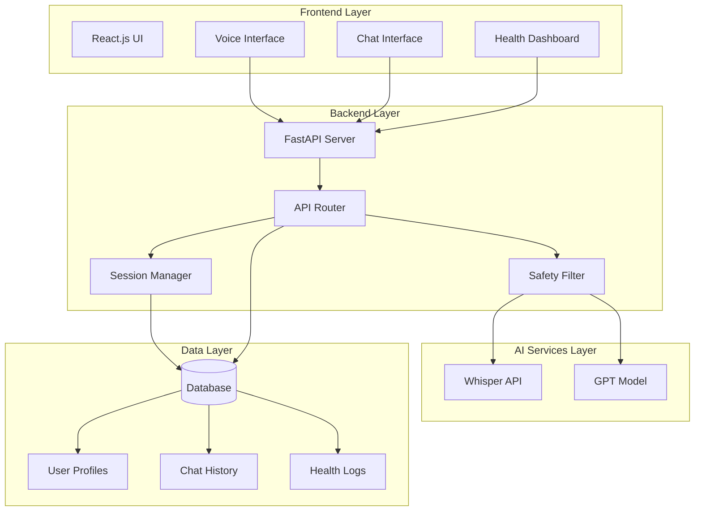

# Design Document: SwasthAI

## Overview

SwasthAI is an AI-powered voice-based community health access platform that enables users to interact with a health assistant using their regional language. The system architecture follows a three-tier design with a React.js frontend, FastAPI backend, and integrated AI services (OpenAI Whisper and GPT models).

The platform addresses the critical need for accessible healthcare information in underserved communities by removing language barriers and providing preventive health guidance in simple, understandable terms. The system emphasizes safety through emergency detection and explicit avoidance of medical diagnosis.

### Key Design Principles

1. **Language Accessibility**: Support for multiple Indian regional languages with automatic detection
2. **Safety First**: Built-in safety filters to detect emergencies and prevent harmful medical advice
3. **Preventive Focus**: Emphasis on preventive healthcare guidance rather than diagnosis
4. **User Privacy**: Secure storage of health data with user-specific profiles
5. **Simplicity**: Simple, non-technical language in all responses

## Architecture

### System Components



### Technology Stack

**Frontend**:
- React.js for UI components
- MediaRecorder API for voice capture
- Axios for HTTP requests
- React Context for state management

**Backend**:
- FastAPI for REST API endpoints
- Pydantic for data validation
- Python asyncio for concurrent processing

**AI Services**:
- OpenAI Whisper API for speech-to-text and language detection
- OpenAI GPT-4 for health response generation

**Database**:
- PostgreSQL for structured data (user profiles, metadata)
- JSON fields for flexible health log storage

**Deployment**:
- Docker containers for backend services
- Cloud hosting (AWS/GCP) for scalability

## Components and Interfaces

### 1. Voice Interface Component

**Responsibility**: Capture user voice input and manage recording state

**Interface**:
```typescript
interface VoiceInterface {
  startRecording(): Promise<void>
  stopRecording(): Promise<Blob>
  getRecordingState(): RecordingState
  onError(callback: (error: Error) => void): void
}

enum RecordingState {
  IDLE,
  RECORDING,
  PROCESSING,
  ERROR
}
```

**Implementation Details**:
- Uses MediaRecorder API with audio/webm codec
- Implements visual feedback during recording
- Handles microphone permissions
- Converts recorded audio to Blob for transmission
- Maximum recording duration: 60 seconds

### 2. Chat Interface Component

**Responsibility**: Display conversation history and manage message flow

**Interface**:
```typescript
interface ChatInterface {
  displayMessage(message: Message): void
  displayTypingIndicator(): void
  hideTypingIndicator(): void
  clearChat(): void
  getChatHistory(): Message[]
}

interface Message {
  id: string
  sender: 'user' | 'ai'
  content: string
  timestamp: Date
  language: string
}
```

**Implementation Details**:
- Auto-scrolls to latest message
- Distinguishes user and AI messages visually
- Supports RTL languages if needed
- Displays timestamps in local timezone

### 3. Health Dashboard Component

**Responsibility**: Display health tracking data and visualizations

**Interface**:
```typescript
interface HealthDashboard {
  displaySymptomLogs(logs: SymptomLog[]): void
  displayHabitTracking(habits: HabitData[]): void
  filterByDateRange(start: Date, end: Date): void
  exportData(): void
}

interface SymptomLog {
  id: string
  userId: string
  symptom: string
  description: string
  timestamp: Date
  aiResponse: string
}

interface HabitData {
  id: string
  userId: string
  habitType: string
  value: string
  timestamp: Date
}
```

**Implementation Details**:
- Uses chart library (Chart.js or Recharts) for visualizations
- Implements date range filtering
- Supports data export to CSV
- Responsive design for mobile devices

### 4. FastAPI Backend Service

**Responsibility**: Handle HTTP requests, route to appropriate services, manage business logic

**API Endpoints**:

```python
# Voice processing endpoint
POST /api/voice/transcribe
Request: multipart/form-data with audio file
Response: {
  "transcription": str,
  "language": str,
  "confidence": float
}

# Chat endpoint
POST /api/chat/message
Request: {
  "user_id": str,
  "message": str,
  "language": str
}
Response: {
  "response": str,
  "is_emergency": bool,
  "requires_professional_care": bool
}

# Health log endpoints
GET /api/health/logs/{user_id}
Response: {
  "logs": List[SymptomLog]
}

POST /api/health/logs
Request: {
  "user_id": str,
  "symptom": str,
  "description": str
}
Response: {
  "log_id": str,
  "created_at": datetime
}

# User profile endpoints
GET /api/users/{user_id}
Response: {
  "user_id": str,
  "language_preference": str,
  "created_at": datetime
}

PUT /api/users/{user_id}
Request: {
  "language_preference": str
}
Response: {
  "updated": bool
}
```

**Implementation Details**:
- Implements CORS for frontend communication
- Uses dependency injection for service components
- Implements request validation with Pydantic models
- Includes rate limiting to prevent abuse
- Implements logging for all requests

### 5. Whisper Service Integration

**Responsibility**: Convert speech to text and detect language

**Interface**:
```python
class WhisperService:
    async def transcribe(
        self,
        audio_data: bytes,
        audio_format: str = "webm"
    ) -> TranscriptionResult
    
    async def detect_language(
        self,
        audio_data: bytes
    ) -> str

@dataclass
class TranscriptionResult:
    text: str
    language: str
    confidence: float
```

**Implementation Details**:
- Uses OpenAI Whisper API (whisper-1 model)
- Converts audio format if needed (webm to mp3)
- Implements retry logic for API failures
- Caches API responses for identical audio (optional optimization)
- Supports languages: hi (Hindi), mr (Marathi), ta (Tamil), te (Telugu), bn (Bengali), en (English)

### 6. AI Response Engine

**Responsibility**: Generate health guidance responses using LLM

**Interface**:
```python
class AIResponseEngine:
    async def generate_response(
        self,
        user_message: str,
        language: str,
        chat_history: List[Message],
        user_health_logs: List[SymptomLog]
    ) -> AIResponse
    
    def build_system_prompt(
        self,
        language: str
    ) -> str

@dataclass
class AIResponse:
    content: str
    language: str
    contains_red_flags: bool
    suggested_actions: List[str]
```

**Implementation Details**:
- Uses OpenAI GPT-4 model
- System prompt includes:
  - Role definition as a preventive health assistant
  - Instruction to respond in specified language
  - Instruction to use simple, non-technical terms
  - Explicit prohibition on diagnosis and prescriptions
  - Instruction to identify red-flag symptoms
  - Focus on preventive guidance (diet, hydration, lifestyle)
- Includes conversation history for context (last 10 messages)
- Considers user's health log history for personalized suggestions
- Temperature set to 0.7 for balanced creativity and consistency

**System Prompt Template**:
```
You are SwasthAI, a preventive health assistant for underserved communities.

Guidelines:
1. Respond in {language} using simple, everyday words
2. Focus on preventive health guidance only
3. NEVER provide medical diagnosis or prescribe medications
4. If symptoms suggest serious conditions, advise consulting a doctor
5. Provide practical suggestions for diet, hydration, and lifestyle
6. Be empathetic and supportive
7. If you detect emergency keywords (severe pain, difficulty breathing, chest pain, etc.), immediately advise seeking emergency medical care

User's health context:
{health_log_summary}

Respond to the user's health concern with care and clarity.
```

### 7. Safety Filter Component

**Responsibility**: Detect emergency situations and prevent harmful advice

**Interface**:
```python
class SafetyFilter:
    def scan_for_emergencies(
        self,
        text: str,
        language: str
    ) -> EmergencyDetection
    
    def validate_ai_response(
        self,
        response: str
    ) -> ValidationResult

@dataclass
class EmergencyDetection:
    is_emergency: bool
    detected_keywords: List[str]
    severity_level: int  # 1-5 scale

@dataclass
class ValidationResult:
    is_safe: bool
    violations: List[str]
    modified_response: Optional[str]
```

**Implementation Details**:
- Maintains multilingual emergency keyword dictionary:
  - English: "chest pain", "can't breathe", "severe bleeding", "unconscious", "heart attack", "stroke"
  - Hindi: "सीने में दर्द", "सांस नहीं आ रही", "बहुत खून बह रहा"
  - Similar translations for other supported languages
- Scans both user input and AI responses
- Implements severity levels:
  - Level 5: Immediate emergency (call ambulance)
  - Level 4: Urgent care needed (visit ER)
  - Level 3: See doctor soon (within 24 hours)
  - Level 2: Schedule appointment
  - Level 1: Monitor and self-care
- Validates AI responses don't contain:
  - Specific drug names or dosages
  - Definitive diagnoses
  - Instructions to avoid medical care
- If violations detected, modifies response to add safety disclaimers

### 8. Session Manager

**Responsibility**: Manage user sessions and conversation context

**Interface**:
```python
class SessionManager:
    async def create_session(
        self,
        user_id: str
    ) -> Session
    
    async def get_session(
        self,
        session_id: str
    ) -> Optional[Session]
    
    async def update_session(
        self,
        session_id: str,
        message: Message
    ) -> None
    
    async def end_session(
        self,
        session_id: str
    ) -> None

@dataclass
class Session:
    session_id: str
    user_id: str
    messages: List[Message]
    created_at: datetime
    last_activity: datetime
```

**Implementation Details**:
- Sessions expire after 30 minutes of inactivity
- Stores session data in Redis for fast access
- Persists completed sessions to database
- Implements session cleanup for expired sessions

## Data Models

### User Profile

```python
class UserProfile(BaseModel):
    user_id: str = Field(default_factory=lambda: str(uuid.uuid4()))
    language_preference: str = Field(default="en")
    created_at: datetime = Field(default_factory=datetime.utcnow)
    last_login: datetime = Field(default_factory=datetime.utcnow)
    total_interactions: int = Field(default=0)
```

**Database Schema** (PostgreSQL):
```sql
CREATE TABLE user_profiles (
    user_id UUID PRIMARY KEY,
    language_preference VARCHAR(10) NOT NULL,
    created_at TIMESTAMP NOT NULL DEFAULT NOW(),
    last_login TIMESTAMP NOT NULL DEFAULT NOW(),
    total_interactions INTEGER NOT NULL DEFAULT 0
);

CREATE INDEX idx_user_last_login ON user_profiles(last_login);
```

### Chat History

```python
class ChatMessage(BaseModel):
    message_id: str = Field(default_factory=lambda: str(uuid.uuid4()))
    user_id: str
    session_id: str
    sender: Literal["user", "ai"]
    content: str
    language: str
    timestamp: datetime = Field(default_factory=datetime.utcnow)
    is_emergency: bool = Field(default=False)
```

**Database Schema**:
```sql
CREATE TABLE chat_messages (
    message_id UUID PRIMARY KEY,
    user_id UUID NOT NULL REFERENCES user_profiles(user_id),
    session_id UUID NOT NULL,
    sender VARCHAR(10) NOT NULL CHECK (sender IN ('user', 'ai')),
    content TEXT NOT NULL,
    language VARCHAR(10) NOT NULL,
    timestamp TIMESTAMP NOT NULL DEFAULT NOW(),
    is_emergency BOOLEAN NOT NULL DEFAULT FALSE
);

CREATE INDEX idx_chat_user_timestamp ON chat_messages(user_id, timestamp DESC);
CREATE INDEX idx_chat_session ON chat_messages(session_id);
```

### Health Log

```python
class HealthLog(BaseModel):
    log_id: str = Field(default_factory=lambda: str(uuid.uuid4()))
    user_id: str
    log_type: Literal["symptom", "habit", "measurement"]
    symptom: Optional[str] = None
    description: str
    ai_response: Optional[str] = None
    severity_level: Optional[int] = None
    timestamp: datetime = Field(default_factory=datetime.utcnow)
    metadata: Dict[str, Any] = Field(default_factory=dict)
```

**Database Schema**:
```sql
CREATE TABLE health_logs (
    log_id UUID PRIMARY KEY,
    user_id UUID NOT NULL REFERENCES user_profiles(user_id),
    log_type VARCHAR(20) NOT NULL CHECK (log_type IN ('symptom', 'habit', 'measurement')),
    symptom VARCHAR(255),
    description TEXT NOT NULL,
    ai_response TEXT,
    severity_level INTEGER CHECK (severity_level BETWEEN 1 AND 5),
    timestamp TIMESTAMP NOT NULL DEFAULT NOW(),
    metadata JSONB
);

CREATE INDEX idx_health_user_timestamp ON health_logs(user_id, timestamp DESC);
CREATE INDEX idx_health_type ON health_logs(log_type);
```

### Audio Recording

```python
class AudioRecording(BaseModel):
    recording_id: str = Field(default_factory=lambda: str(uuid.uuid4()))
    user_id: str
    audio_data: bytes
    audio_format: str = Field(default="webm")
    duration_seconds: float
    transcription: Optional[str] = None
    detected_language: Optional[str] = None
    created_at: datetime = Field(default_factory=datetime.utcnow)
```

**Storage Strategy**:
- Audio files stored in cloud object storage (S3/GCS)
- Metadata stored in database
- Audio files deleted after 7 days (privacy)
- Only transcriptions retained long-term

## Correctness Properties

*A property is a characteristic or behavior that should hold true across all valid executions of a system—essentially, a formal statement about what the system should do. Properties serve as the bridge between human-readable specifications and machine-verifiable correctness guarantees.*

